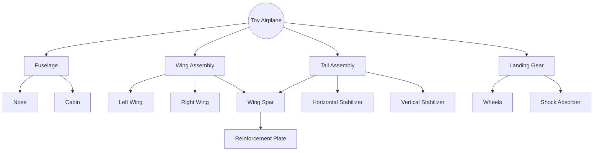

```mermaid
flowchart TB
    A((Toy Airplane)) --> B[Fuselage]
    A --> C[Wing Assembly]
    A --> D[Tail Assembly]
    A --> E[Landing Gear]

    %% Subpartes del Fuselaje
    B --> B1[Nose]
    B --> B2[Cabin]
    
    %% Ensamblaje de alas
    C --> C1[Left Wing]
    C --> C2[Right Wing]
    C --> H[Wing Spar]

    %% Ensamblaje de cola
    D --> D1[Horizontal Stabilizer]
    D --> D2[Vertical Stabilizer]
    D --> H

    %% Tren de aterrizaje
    E --> E1[Wheels]
    E --> E2[Shock Absorber]

    %% Detalle de pieza compartida
    H --> H1[Reinforcement Plate]
```
